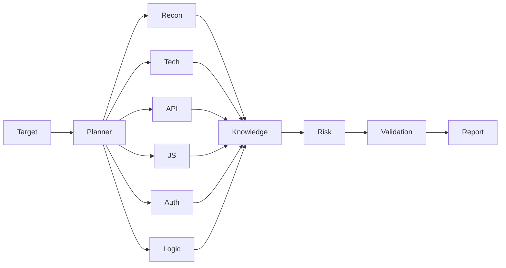

# 🛡️ LogicLens AI

> **AI-Powered Multi-Agent Web Application Security Assessment Platform**

<p align="center">
  
</p>

<p align="center">


</p>

---

## 🚀 Overview

LogicLens AI is an AI-powered multi-agent platform for passive web application security assessment built using **Google ADK**, **Gemini 2.5**, **FastAPI**, and **React JS**. Multiple specialized AI agents collaborate to analyze web applications, validate findings, and generate professional security reports.

---

# 🎬 Demo

## Demo Video
https://youtube.com/

## Live Demo
https://logiclens-adk-7fbwe3it3a-ue.a.run.app/
---

# 📸 Screenshots


```md


```

---

# ✨ Features

- Google ADK Multi-Agent Architecture
- Gemini 2.5 Flash & Pro
- Passive Web Reconnaissance
- Technology Fingerprinting
- JavaScript Analysis
- API Discovery
- Authentication Analysis
- Business Logic Analysis
- Workflow Learning
- Collaborative Reasoning
- Evidence Validation
- Risk Scoring
- Professional Security Reports
- Modern React Dashboard

---

# 🏗 Architecture

```md


```

---

# 🤖 Multi-Agent Workflow




---

# 🛠 Tech Stack

## Frontend

- ReactJS (JSX)
- Vite
- Tailwind CSS

## Backend

- FastAPI
- Python
- Uvicorn

## AI

- Google ADK
- Google Gemini API
- Google GenAI SDK
- Gemini 2.5 Flash
- Gemini 2.5 Pro

## Google Cloud

- Cloud Run
- Cloud Build
- Artifact Registry
- Cloud Storage

---

# 🚀 Installation

```bash
git clone https://github.com/<username>/LogicLens-AI.git

cd LogicLens-AI
```

## Backend

```bash
cd backend

python -m venv .venv

pip install -r requirements.txt

uvicorn app.main:app --reload
```

## Frontend

```bash
cd frontend

npm install

npm run dev
```

Open:

http://localhost:5173

Enter your Gemini API key in the UI.

---

# 🔑 Gemini API Key

Users provide their own Gemini API key from the frontend.

The backend does not permanently store the API key.

---

# 🐳 Docker

```bash
docker build -t logiclens-ai .

docker run -p 8000:8000 logiclens-ai
```

---

# ☁ Deploy to Cloud Run

```bash
gcloud builds submit

gcloud run deploy logiclens-ai
```

---

# 📊 Reports

Each assessment contains:

- Executive Summary
- Findings
- Risk Score
- Severity
- Confidence
- AI Reasoning
- Evidence
- Remediation

---

# 🙏 Acknowledgements

- Google ADK
- Google Gemini
- FastAPI
- React
- Docker
- Google Cloud

---

<p align="center">

**LogicLens AI**

AI-Powered Multi-Agent Web Application Security Assessment Platform

Built with ❤️ using Google ADK, Gemini 2.5, FastAPI, React and Google Cloud.

</p>
